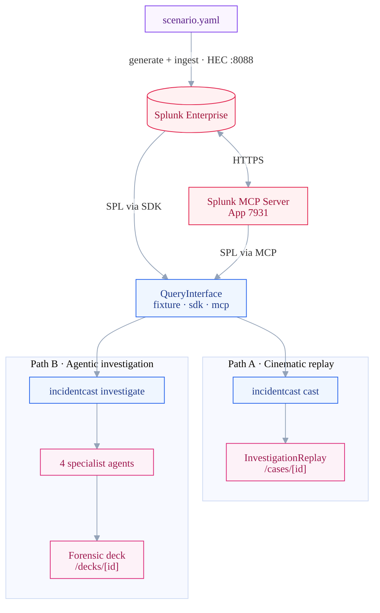

# IncidentCast

A **live incident reasoning room**. When an incident triggers, four
Splunk-powered specialist perspectives — **Reliability, Deployment, Access, and
Blast Radius** — investigate from different angles: theories rise and fall as
evidence lands, and the room converges, on screen, onto a single root cause.
Every claim is backed by a **real Splunk search** — run live through the official
**Splunk MCP Server** or the **Splunk SDK** — viewable as the literal SPL and the
rows it returned.

Built for the **Splunk Agentic Ops Hackathon** (Observability track).
Targets: Grand Prize · Best of Observability · **Best Use of Splunk MCP Server**.

See [architecture_diagram.md](./architecture_diagram.md) for the full data + control flow.

## What makes it different

- **Multi-perspective, not single-prompt.** Four specialists with **distinct
  goals, distinct lead questions, and non-overlapping owned SPL repertoires**
  (enforced as a code property by `tests/test_repertoire_ownership.py`, not
  a hope about prompt design).
- **Evidence-cited every step.** The `emit_finding` MCP tool rejects any claim
  that doesn't quote rows from a prior `splunk_run_query` the same specialist
  just ran. The deck UI lets a reviewer click any claim and see the literal
  SPL + the raw rows.
- **Splunk MCP is the agent surface.** In MCP mode, each specialist agent
  literally calls `mcp__splunk__splunk_run_query` on Splunk's official MCP
  Server. Splunk is the investigation substrate, not a webhook source.
- **Cross-agent agreement is the confidence signal.** A **rule-based**
  aggregator clusters findings by time window + shared entity + shared tag.
  No LLM self-reported confidence. When four specialists' evidence lands on
  the same revision in the same five-minute window, that's the story the
  deck leads with.
- **Human decides.** The deck ends with *"what to review next"* prompts,
  never with imperative remediation. No automatic actions.

## Architecture

See [architecture_diagram.md](./architecture_diagram.md) for the complete, high-fidelity architecture documentation, component deep-dives, and design principles.

### System Topology


### Live Sourcing Flow (Path C)

```mermaid
%%{init: {"theme":"base","htmlLabels":false,"themeVariables":{"fontFamily":"ui-sans-serif, system-ui, -apple-system, sans-serif","fontSize":"14px","lineColor":"#94a3b8","edgeLabelBackground":"#ffffff"},"flowchart":{"htmlLabels":false,"curve":"basis","nodeSpacing":45,"rankSpacing":55,"padding":10}}}%%
flowchart LR
    UI["Browser · /cases/[id]<br/>Inspect evidence"] -->|"GET /api/splunk/evidence"| API["Evidence API<br/>Next.js route"]
    API -->|"splunk_admin.py mcp-query"| CL["SplunkMCPQueryClient"]
    CL -->|splunk_run_query| MCP["Splunk MCP Server"]
    MCP --> SE[("Splunk Enterprise")]
    SE -.->|"rows + SPL + backend"| UI
    classDef scn fill:#faf5ff,stroke:#7c3aed,color:#581c87;
    classDef spl fill:#fff1f2,stroke:#e11d48,color:#9f1239;
    classDef core fill:#eff6ff,stroke:#2563eb,color:#1e3a8a;
    classDef ui fill:#fdf2f8,stroke:#db2777,color:#9d174d;
    class UI,API ui
    class CL core
    class MCP,SE spl
```



## Splunk AI capabilities used

IncidentCast uses the **Splunk MCP Server** (Splunkbase App 7931) as a *runtime* Splunk AI
capability — Splunk is not a passive data store here, it is queried live by AI agents through MCP.

- **AI specialists query Splunk via MCP at runtime.** With `--backend mcp`, each specialist agent
  calls Splunk's own `splunk_run_query` MCP tool directly (see
  `incidentcast/specialists/runtime.py::_investigate_mcp`). The exact SPL, returned rows, and
  `backend: "mcp"` provenance are recorded into the generated `InvestigationReplay` artifact.
- **The PermissionDenied evidence modal demonstrates a live MCP query.** On the final convergence
  screen → **Inspect evidence** → **Open ↗** on a proof's SPL opens the compact *Live Splunk
  Evidence* modal. It connects to the Splunk MCP Server, invokes `splunk_run_query`, and shows the
  rows Splunk returns — with a visible **Splunk MCP connected · Live MCP query executed · N rows
  returned from Splunk** banner. The call path is
  `UI → GET /api/splunk/evidence?backend=mcp → scripts/splunk_admin.py mcp-query →
  SplunkMCPQueryClient → Splunk MCP Server → Splunk Enterprise`, and each invocation logs
  `Splunk MCP evidence query executed …` in the server console for auditability.
- **Fixture mode exists only as an offline fallback.** It lets judges play the room with no Splunk
  attached, and is what the modal falls back to (clearly labeled *“MCP unavailable. Showing captured
  Splunk evidence.”*) if MCP is unconfigured or unreachable. Live MCP and captured/fixture are never
  blurred: the modal only shows the live banner when a real MCP call actually succeeded.

To prove it end to end: set `SPLUNK_MCP_URL` / `SPLUNK_MCP_TOKEN` in `.env` (run
`./scripts/setup_splunk_mcp.sh`), open the case, converge, **Inspect evidence**, **Open** the
Access proof, and watch the modal execute a live MCP query against Splunk.

## Demo scenario

A Cloud Run revision (`checkout-api-00042`, commit *"migrate service account to
least-privilege SA; remove legacy editor binding"*) revokes the Secret Manager
binding checkout needs for its Stripe key. The IAM binding is removed **3 seconds
before** the deploy; checkout starts failing ~48s later.

When the room investigates, each perspective surfaces a different angle:

- **Reliability:** error rate ~0.5% → ~30% within two minutes; `PermissionDenied`
  on `secretmanager.versions.access` dominates the 5xx (2,570 error-log lines) —
  not load (request volume stays flat).
- **Deployment:** `checkout-api-00042` deployed `14:01:15`, ~48s before the spike;
  its commit migrates the runtime service account; no rollback on record.
- **Access:** `roles/secretmanager.secretAccessor` removed from
  `checkout-api@acme-prod…` at `14:01:12` on `checkout-stripe-key`; 583
  `PERMISSION_DENIED` audit events on `AccessSecretVersion` follow.
- **Blast Radius:** checkout **write** path fails (~21%) while reads stay healthy
  (~0.5%); three downstream services error ~100%; failure confined to
  `us-central1` (~27%) while `us-east1`/`eu-west1` stay under 0.5%.

The room rules out overload and regional outage and converges on **secret-access
failure, triggered by revision `checkout-api-00042`** — the same revision the
rule-based aggregator independently anchors on as a build-time guardrail.

## Quick start

### Prerequisites
- Python 3.11+
- Node 20+
- (live backends only) Splunk Enterprise (10.x, trial is fine) running locally with HEC enabled
- (`--backend mcp` only) the official **Splunk MCP Server** Splunkbase app (App ID 7931)
  installed in your Splunk instance

### 1) Install
```bash
python3 -m venv .venv && source .venv/bin/activate
pip install -e ".[dev,splunk]"
cd web && npm install && cd ..
```

### 2) Run it — one command
```bash
cd web && npm run dev
# → http://localhost:3000/cases/cloud_run_secret_loss
```
That's it. The repo ships with a committed offline (fixture) replay, so the room plays through
with **no Splunk required** — which is exactly how judges run it.

### 3) Everything else lives in the **Settings menu** (⚙ top-right)
Open the gear on the workspace and you can, without leaving the page:
- **Switch the evidence source** — re-cast the replay from **Fixture**, **Splunk SDK**, or the
  **Splunk MCP Server**, then the workspace reloads with live-sourced evidence (the EvidenceDrawer
  shows "source: Splunk MCP/SDK", witnesses show "via mcp/sdk").
- **See what's in Splunk** — connection status + per-index event counts, run any of the case's
  owned SPL queries live (rows + the resulting job SID), and **open in Splunk Web** (deep-links to
  `:8000` with the SPL + time window pre-filled).

> Live backends need a local Splunk (set `SPLUNK_PASSWORD` etc. in `.env`; `--backend mcp` also
> needs the Splunk MCP Server, Splunkbase App 7931). The Settings panel calls local dev API routes
> (`/api/cast`, `/api/splunk/*`) that shell out to the CLI with whitelisted args — no free-form input.

### CLI equivalents (optional)
```bash
./scripts/demo.sh [fixture|sdk|mcp]   # provision + ingest + cast from the terminal (idempotent)
scripts/refresh_fixtures.py           # regenerate the offline fixtures from live Splunk (fixture == live)
incidentcast investigate data/incidents/example.yaml --backend mcp   # the autonomous-agent path → /decks/[id]
```

## Project layout

```
incidentcast/
  splunk/
    interface.py         # QueryInterface Protocol + QueryResult
    fixture_client.py    # offline: canned rows from data/fixtures/
    sdk_client.py        # live: splunklib jobs.oneshot
    mcp_client.py        # live: Splunk MCP Server splunk_run_query (Streamable HTTP)
  specialists/
    base.py              # SpecialistSpec, Finding (carries backend + job_id), Deck
    runtime.py           # Specialist class (agentic investigate path)
    reliability.py       # SpecialistSpec + owned SPL repertoire
    deployment.py
    blast_radius.py
    access.py
  replay.py              # cast pipeline: materialize_via_backend + build_replay
  aggregator.py          # rule-based clustering → SharedEvidence (convergence guardrail)
  deck.py                # builds the deck.json artifact
  cli.py                 # `incidentcast` entry point (cast + investigate)
data/
  cases/cloud_run_secret_loss.yaml   # authored case: theories, 3 decisions, step graph
  fixtures/cloud_run_secret_loss/    # canned QueryResults (offline; refreshed from live)
  scenarios/cloud_run_secret_loss/   # scenario.yaml + generate.py + HEC ingest.py
  incidents/example.yaml             # incident trigger payload (agentic path)
web/                                  # Next.js 14 — /cases/[id] room + /decks/[id] deep-dive
web/
  app/
    cases/[id]/          # the live reasoning room (primary surface)
    decks/[id]/          # forensic deep-dive (DeckView)
    api/cast             # Settings → re-cast the replay from a backend
    api/splunk/{status,query,evidence}   # live Splunk status / SDK query / MCP evidence
  components/            # InvestigationWorkspace, TheoryStrip, InvestigationStage,
                         # ActivityFeed, SettingsMenu, LiveSplunkEvidence, DeckView, …
  lib/                   # replay.ts / deck.ts (zod schemas) + admin/splunk helpers
  public/cases/<id>.json # committed offline replay (how judges run it)
scripts/
  setup_splunk.sh        # indexes, HEC, KV_MODE
  setup_splunk_mcp.sh    # MCP token (audience=mcp)
  refresh_fixtures.py    # regenerate offline fixtures from live Splunk
  splunk_admin.py        # backend for the Settings API routes (status / SDK query / MCP evidence)
  demo.sh [fixture|sdk|mcp] [case_id]
```

## Tests

```bash
pytest -q   # 31 tests across 4 files, ~1s, no Splunk required
```

- `test_repertoire_ownership.py` — how "specialists are structurally distinct"
  becomes a build-time property rather than a hope (no two specialists own or
  import the same `QueryTemplate`).
- `test_backend.py` — a fake `QueryInterface` proves `materialize_via_backend`
  binds the right `backend`/`job_id` and substitutes SPL, and that `_select_rows`
  clamps correctly across backends.
- `test_aggregator.py` — rule-based clustering (time window + shared entity +
  shared tag) anchors the top cluster on the revision.
- `test_replay.py` — `build_replay` asserts every authored step can reach a
  converged terminal.

## License

[Apache-2.0](./LICENSE)
