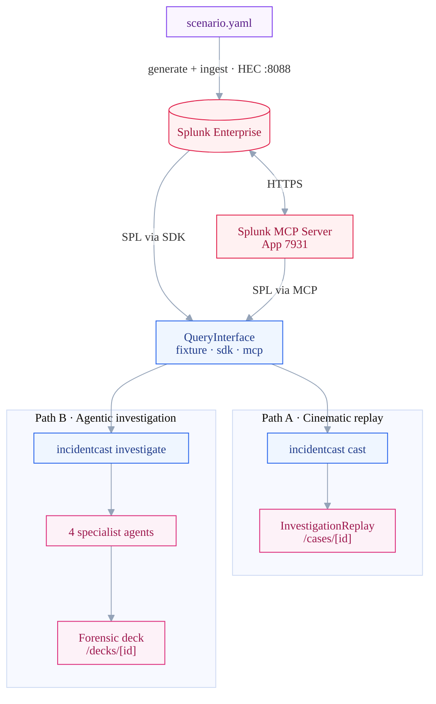
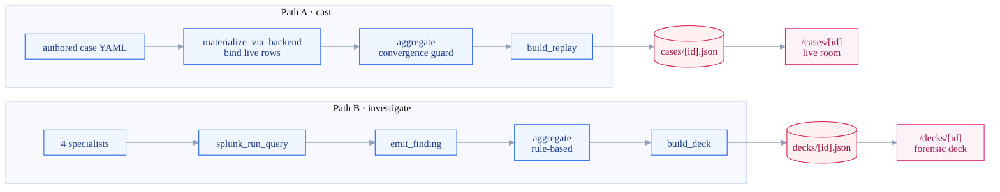
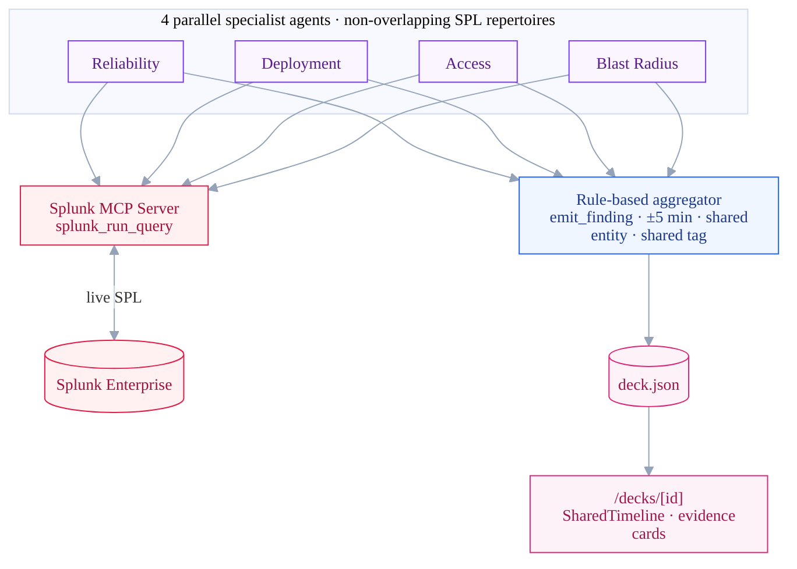
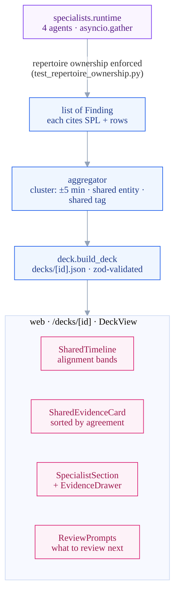
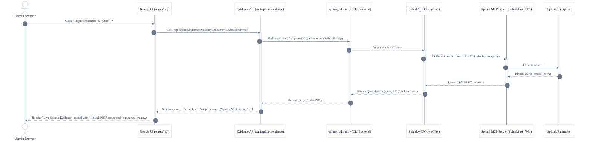

# IncidentCast — Comprehensive System Architecture

IncidentCast is a **live incident reasoning room**: four specialist perspectives (Reliability, Deployment, Access, and Blast Radius) investigate one incident from different angles. Theories rise and fall as evidence lands, and the room converges on a single, citation-grounded root cause. 

Every claim is backed by a **real Splunk search** — run through the official **Splunk MCP Server** or the **Splunk SDK** — surfaced behind each claim as the literal SPL and the rows it returned.

---

## 1. High-Level Architectural Overview

IncidentCast is built around a unified query interface that decouples investigation logic from the underlying data source. This allows the system to serve two different consumers of the same Splunk evidence:

1. **Path A: Cinematic Replay (`/cases/[id]`)** — The primary, cinematic product. An authored case (theories, ~3 strategic decision prompts, a step graph, and witness lines) supplies the narrative scaffold, while the *evidence* under every claim is fetched **live from Splunk at cast-time** via the `QueryInterface`.
2. **Path B: Autonomous Investigation (`/decks/[id]`)** — Four LLM specialist agents call the Splunk MCP Server's `splunk_run_query` autonomously, analyze logs/metrics, and emit evidence-cited findings to a rule-based aggregator that builds a forensic deck.

### End-to-End Control & Data Flow (Visual Pipeline)

---

## 2. Core Design Principles

These non-negotiable principles anchor all engineering decisions in IncidentCast:

1. **Evidence over assertion.** Every claim in the workspace or forensic deck MUST cite a specific `(source_query_spl, source_rows)` pair. In Path B, the `emit_finding` tool strictly rejects any citations that don't match a prior `splunk_run_query` executed by that specialist in the active session.
2. **Splunk MCP is the agent surface, not an afterthought wrapper.** In `--backend mcp` mode, specialist agents literally invoke `mcp__splunk__splunk_run_query` on the official Splunk MCP Server. A `PostToolUse` hook intercepts the execution to map the generated SPL back to the canonical owned `QueryTemplate`.
3. **Rule-based cross-agent agreement is the confidence signal.** The aggregator is rule-based and deterministic, never LLM-judged. It clusters findings by physical overlaps (time windows, shared entities, and shared tags). LLM self-reported "confidence" is discarded; true confidence is derived mathematically from multi-agent convergence.
4. **The human decides.** All suggestions generated by the system are framed strictly as review prompts (*"Review deployment logs..."*, *"Verify IAM permissions..."*), never as imperative commands. The final output is "what to review next," not "what to do."
5. **Depth over breadth.** A strictly typed `QueryInterface` Protocol decouples specialists and casing layers from the data provider. Implementing three backends (`fixture`, `sdk`, `mcp`) ensures we can demo end-to-end without a live Splunk instance and switch to MCP seamlessly without altering specialist core logic.

---

## 3. Component Details: Agentic `investigate` Path (Path B)

When running autonomous investigations via `incidentcast investigate <incident_path> --backend mcp`, the system orchestrates parallel LLM agent lifecycles, aggregates their telemetry, and outputs a validated forensic deck.

### Component Architecture & System Boundaries

---

## 4. Specialist Distinctness, Enforced

To prevent agents from devolving into generic LLM conversationalists, each specialist is constructed from a strictly declarative `SpecialistSpec`:

* **`goal`** — A single-sentence north star representing its technical mission.
* **`lead_question`** — The primary question this specialist must answer.
* **`sub_questions`** — A sequence of 3–5 concrete questions pursued in order.
* **`query_repertoire`** — The collection of SPL templates owned exclusively by this specialist.
* **`output_tags`** — The structured tag namespaces emitted by this specialist.

### Automated Ownership Safeguards

The system prompt for each agent is generated programmatically from its spec, ensuring that the specification remains the code-level source of truth. 

To enforce true functional separation, the test suite (`tests/test_repertoire_ownership.py`) runs as a build-time guardrail. It fails the build if:
1. Any `QueryTemplate` is claimed by more than one specialist.
2. Any template's name does not carry its owner's canonical namespace prefix (e.g., `reliability__`, `access__`).

---

## 5. Path C — On-Demand Live MCP Evidence

Beyond cast-time sourcing, the converged room allows a reviewer to execute a search live on demand. Opening any finding's SPL in the compact **Live Splunk Evidence** modal triggers a live MCP query against the Splunk MCP Server, providing instant, auditable verification of the data:

This ensures that any claim can be proven live, on demand, from the user interface. If the live MCP server is unconfigured or unreachable, the modal falls back to captured replay rows as a non-blocking safety net, clearly labeled as captured evidence.

---

## 6. Data Flow on the Demo Scenario

The bundled scenario (`data/scenarios/cloud_run_secret_loss/`) simulates a Cloud Run revision losing access to Secret Manager:

| Time (UTC) | Event | Index |
| :--- | :--- | :--- |
| **14:01:12** | IAM binding removed: `secretmanager.secretAccessor` ✕ `checkout-api@…` | `iam_changes`, `cloud_audit` |
| **14:01:15** | Deploy `checkout-api-00042` ("migrate service account to least-privilege SA") | `deploys` |
| **14:02:03** | First `PERMISSION_DENIED` on `AccessSecretVersion` | `cloud_audit` |
| **14:02–14:14** | Error rate spikes ~0.5% → ~30%, p99 latency degrades ~185 ms → ~1.5 s | `app_logs` |
| **14:02–14:14** | Downstream order-fulfillment, notification, and payment gateways hit ~100% error | `app_logs` |

### Convergence Resolution

During the run, all four specialists surface evidence pinned to a shared entity set:
* **Revision:** `checkout-api-00042`
* **Principal:** `checkout-api@acme-prod-cf2.iam.gserviceaccount.com`
* **Secret:** `checkout-stripe-key`
* **Role:** `roles/secretmanager.secretAccessor`

The aggregator clusters these findings mathematically into a single `SharedEvidence` with `supporting_specialists = 4`. This triggers room convergence on the UI:

> **Converged Conclusion:** All four specialists — reliability, deployment, access, and blast radius — converged on revision `checkout-api-00042` in the same window.
> 
> *Blast Radius analysis confirms failure is confined strictly to `us-central1` (~27%) with `us-east1` and `eu-west1` remaining healthy (<0.5%). Furthermore, only the checkout write path fails (~21%) while reads remain unaffected (~0.5%), ruling out a regional outage and pointing directly to the specific secret.*

---

## 7. Offline Sourcing vs. Live Environments

To guarantee a seamless experience for judges, the public repository is fully executable offline:

* **Offline Mode (Default):** The `FixtureQueryClient` intercepts queries and serves canned JSON rows from `data/fixtures/`. Run commands like `cast --backend fixture` will recreate the exact committed `web/public/cases/<id>.json` file.
* **Fixture Consistency:** The script `scripts/refresh_fixtures.py` can be executed against a live Splunk instance to query fresh data and regenerate the local JSON files. This ensures that **fixture == live == the committed artifact**.
* **Live Modes (`--backend sdk` / `--backend mcp`):** These run the exact same logical pipelines against active Splunk Enterprise or Splunk MCP Server instances, proving the operational readiness of the system.
